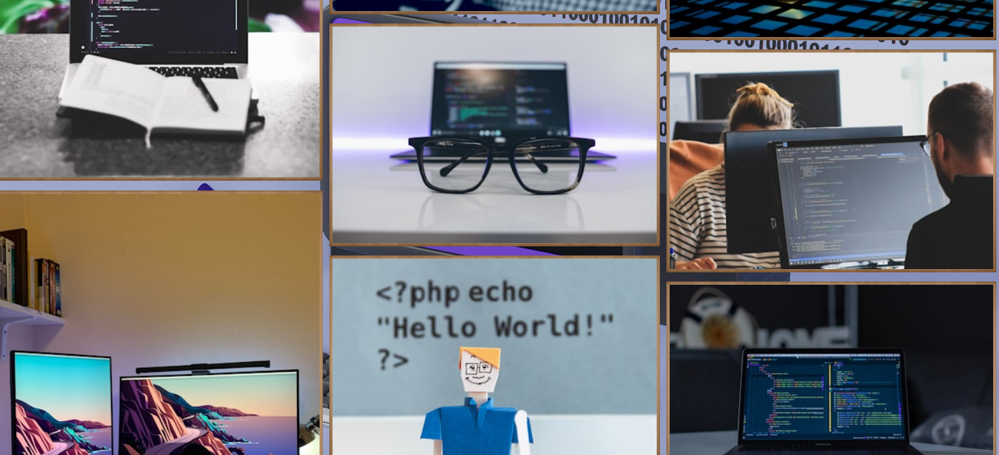

# Mickey’s Personalized Web App Project from Scrimba.com

<p style="text-align: center;">
  <a href="https://vitejs.dev/">
    
  </a>
  <a href="https://reactjs.org/">
    
  </a>
  <a href="LICENSE">
    
  </a>
  <a href="https://vite-react-personalized-webapp.netlify.app/">
    
  </a>
</p>


A React-based web app that fetches and displays coding-related (or photos of your choosing) photos from Unsplash, powered by Vite for a more modern developer experience instead of Webpack.

**👉 [Check out the live demo here](https://vite-react-personalized-webapp.netlify.app/)**

---

## Table of Contents

- [Features](#features)  
- [Demo / Screenshots](#demo--screenshots)  
- [Getting Started](#getting-started)  
- [How It Works](#how-it-works)  
- [Technologies Used](#technologies-used)  
- [Contributing](#contributing)  
- [License](#license)  
- [Contact](#contact)  

---

## Features

- Fetches random photos from Unsplash using the Unsplash Photo API.  
- Search functionality to query photos by keyword (check comments in main.jsx file to update). 
- Responsive grid layout for displaying photos with captions (check comments in style.css to update).  
- Uses React hooks and functional components.  
- Built with Vite instead of Webpack for faster development and build times.
- Check code/comments to update the search query to your liking or the grid layout such as 3 x 3 or 2 x 2, etc.

---

## Demo / Screenshots

Screenshots displaying the app!





---

## Getting Started

### Prerequisites

Download [Node.js](https://nodejs.org/).

### Installation

1. Clone the repo:

    ```bash
    git clone https://github.com/yourusername/your-repo-name.git
    cd your-repo-name
    ```

2. Install dependencies:

    ```bash
    npm install
    ```

3. Start the development server:

    ```bash
    npm run dev
    ```

4. Open your browser at the URL shown in the terminal (usually `http://localhost:3000` or `http://localhost:5173`).

---

## How It Works

* Uses Unsplash’s API to fetch random photos based on a search query.
* Displays photos in a responsive grid layout with author credits.
* Allows users to search for new photos dynamically.

---

## Technologies Used

* React (16.13.1)
* Vite
* Unsplash API
* CSS custom properties and grid layout

---

## Contributing

Contributions are welcome! Feel free to open issues or submit pull requests.

---

## License

This project is licensed under the MIT License. See the [LICENSE](LICENSE) file for details.

---

## Contact

Created by Scrimba, updated by mickey_codes/backspacespacey.
Find me on [GitHub](https://github.com/backspacespacey) | [LinkedIn](https://www.linkedin.com/in/mickey-b-b65302370/)

---